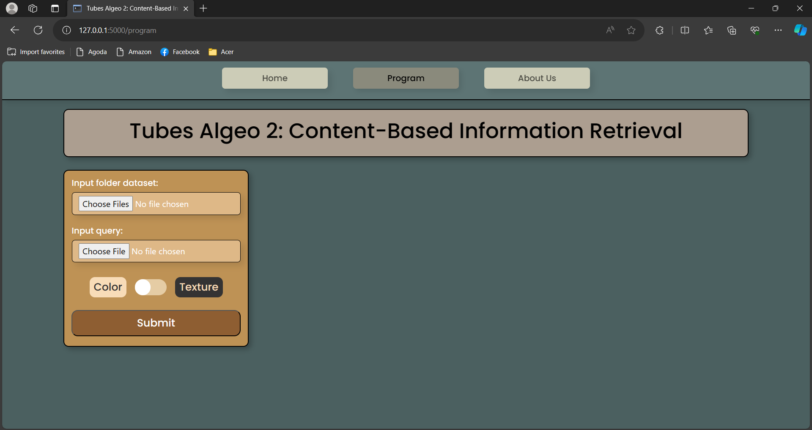

# Project Name

> Program pencarian gambar menggunakan _Content-Based Image Retrieval_ (CBIR)

## Table of Contents

- [General Info](#general-information)
- [Technologies Used](#technologies-used)
- [Features](#features)
- [Screenshots](#screenshots)
- [Setup](#setup)
- [Usage](#usage)
- [Project Status](#project-status)
- [Room for Improvement](#room-for-improvement)
- [Acknowledgements](#acknowledgements)
- [Contact](#contact)

## General Information

- Content-Based Image Retrieval (CBIR) adalah sebuah proses yang digunakan
  untuk mencari dan mengambil gambar berdasarkan kontennya. Proses dimulai dari
  mengekstrak gambar query dan dataset untuk mendapatkan fitur-fitur utamanya seperti warna, tekstur,
  bentuk, dll. Setelah didapatkan fitur, CBIR melakukan algoritma pencocokan untuk
  membandingkan fitur-fitur yang ada. Fitur yang memiliki tingkat kecocokan paling
  tinggi dengan fitur gambar query akan ditampilkan, sehingga muncul gambar-gambar
  yang "mirip" dengan query berdasarkan fitur tertentu. Search Engine ini memanfaatkan teknik CBIR ini
  untuk mengidentifikasi gambar berdasarkan konten visualnya, seperti warna dan tekstur.
  Program akan kemudian menggunakan informasi yang didapatkan untuk
  mencari gambar di dalam database yang menyerupai gambar awal.
- Tujuan kami dalam membuat proyek ini adalah untuk membuat search engine yang dapat mencari gambar berdasarkan warna dan tesktur gambar tersebut.

## Technologies Used

- Bootstrap - version 5.3.2
- Flask - version 3.0.0

## Features

- Melakukan pencarian gambar berdasarkan warna gambar yang di upload
- Melakukan pencarian gambar berdasaran tekstur gambar yang di upload
- Mencari gambar di dalam dataset yang memiliki tingkat kemiripan yang paling tinggi

## Screenshots

<!-- If you have screenshots you'd like to share, include them here. -->

## Setup

> Requirements:

- [Python version 3.11.6](https://www.python.org/downloads/release/python-3116/)
- Library tambahan python berikut:
  - numpy  
    `pip install numpy`
  - os 
    `pip install os`
  - shutil 
    `pip install shutil`
  - PIL  
     `pip install PIL`
  - flask  
     `pip install flask`
  - pathlib  
     `pip install pathlib`
  - numba  
     `pip install numba`

## Usage

- Jalankan servernya dengan menuliskan 2 perintah berikut ke dalam terminal:
  - `cd src`
  - `python server.py`
- Klik tombol **Program** yang terdapat di navigation bar website.
- Upload dataset yang ingin digunakan.
- Upload gambar yang ingin digunakan.
- Pilih metode CBIR (warna / tekstur)
- Klik tombol **Submit**.

## Project Status

Project is: *complete*

## Room for Improvement

Room for improvement:

- Design website
- CBIR Algorithm 

To do:

- Tidak ada

## Acknowledgements

- Agil Fadillah Sabri
- Irfan Sidiq Permana
- Diero Arga Purnama

## Contact

- 13522006@std.stei.itb.ac.id
- 13522007@std.stei.itb.ac.id
- 13522056@std.stei.itb.ac.id